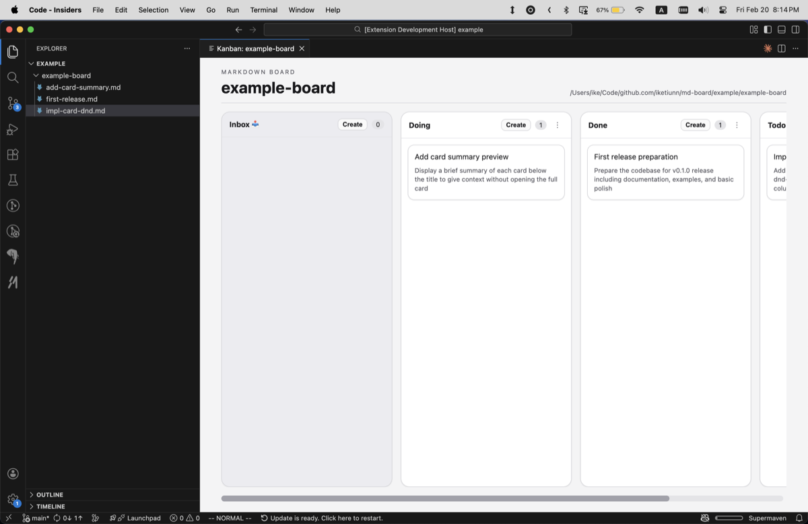
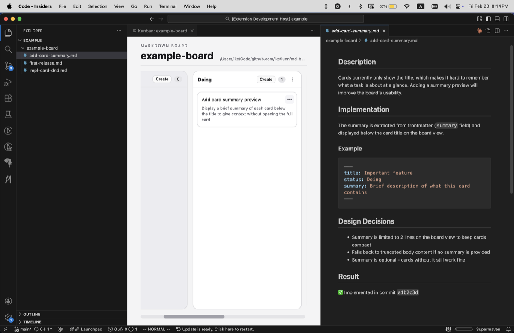
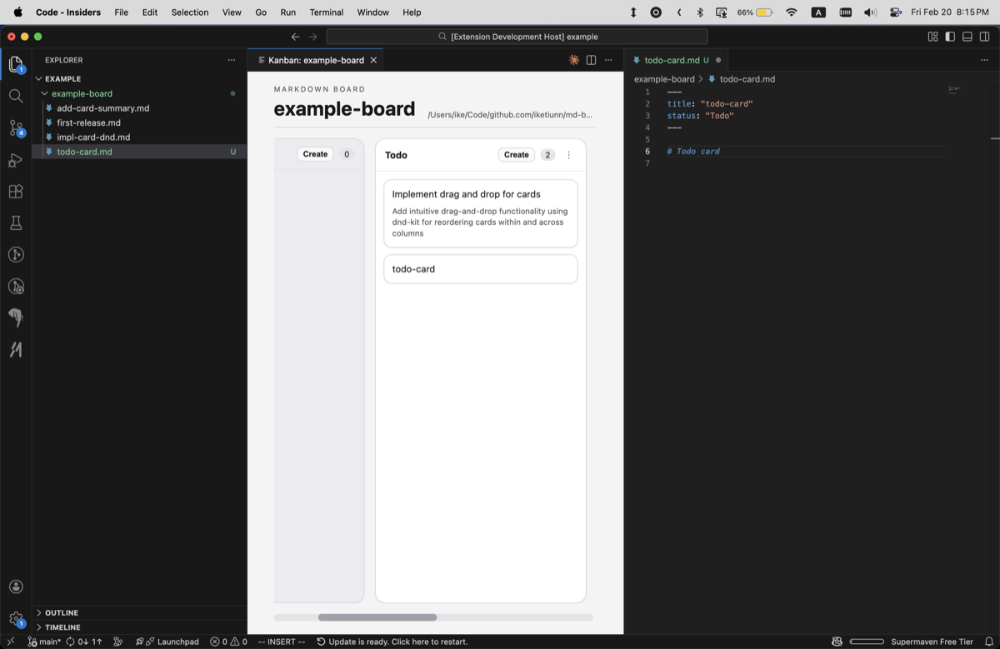

# Markdown Board

Visualize a folder of Markdown files as a Kanban board in VS Code:.

Each `.md` file with a `title` in frontmatter becomes a card; `status` determines the column.



<details>
<summary>More</summary>

**Card Preview**



**Edit Card**



</details>

## Quick Start

1. Right-click a folder in Explorer
2. Select **Open Folder as Kanban Board**
3. Click cards to preview, drag to move, or use `•••` for actions

## Features

- **Cards**: Click to preview, drag to move, `•••` for Edit/Move/Delete
- **Columns**: Drag headers to reorder (Inbox stays first), `⋮` to delete empty columns
- **Create**: Click **Create** in any column header
- **Auto-refresh**: Watches files for external changes

## Card Format

```md
---
title: "Required card title"
status: "Column name"  # Optional, defaults to Inbox 📥
summary: "Some text..."    # Optional
---
```

## Development

```bash
npm install
npm run compile  # or npm run watch
```

Press `F5` to launch the Extension Development Host.

## Project Structure

- `src/extension.ts` - Entrypoint
- `src/kanban/panel.ts` - Panel lifecycle
- `src/kanban/data.ts` - Card loading
- `src/kanban/webview/` - Board UI (Preact + dnd-kit)

## License

MIT
